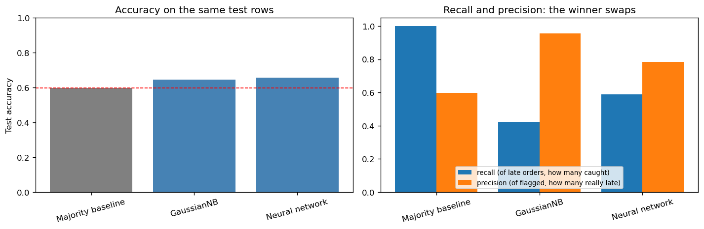

# Predicting Late Shipments

An individual coursework project comparing Gaussian Naive Bayes and a small Keras neural network on 10,999 e-commerce orders, followed by a shared evaluation notebook. The target is `Reached.on.Time_Y.N`: **1 means late**, despite the column's name.

## Data and question

The included `Train.csv` has ten predictors after excluding ID and target: warehouse, shipping mode, customer care calls, rating, product cost, previous purchases, product importance, gender, discount and weight. The practical question is which orders to flag for follow-up, rather than accuracy alone.

The data contain no route, carrier, distance or dates. Availability at prediction time is also uncertain: customer ratings or care calls may occur after the event being predicted. A real pre-shipment application would need a timestamp/feature-availability audit before using these scores.

## Workflow

| Notebook | Work |
|---|---|
| `01_naive_bayes.ipynb` | Stratified 80/20 split, training-only one-hot encoding, GaussianNB and majority baseline |
| `02_neural_network.ipynb` | Inner train/validation split before preprocessing, eight network configurations, final fit and saved test predictions |
| `03_comparison.ipynb` | Refit baseline/GaussianNB and compare against the saved selected network on exactly matching test row IDs |

The neural-network search varies hidden layers, units and regularisation. Each candidate uses 30 epochs and is selected by final-epoch validation accuracy. After selection, preprocessing and the chosen network are fitted on the full outer training partition. Seed and deterministic TensorFlow operations are set for the rerun.

The comparison consumes `neural_network_predictions.csv` and checks row IDs and labels instead of silently retraining a hard-coded network. Selected settings and scores are recorded in `selected_model.json`; [comparison_results.csv](comparison_results.csv) contains the evaluated metrics.



## Rerun results

| Model | Accuracy | Late recall | Late precision | Late F1 | Flagged orders |
|---|---:|---:|---:|---:|---:|
| Majority baseline | 59.68% | 1.000 | 0.597 | 0.748 | 2,200 |
| GaussianNB | 64.41% | 0.424 | 0.955 | 0.587 | 582 |
| Neural network | 65.68% | 0.588 | 0.783 | 0.672 | 986 |

The validation-selected network has one hidden layer of 16 units and L1/L2 strength 0.0001. Its accuracy is higher than GaussianNB in this run, while GaussianNB is more precise on fewer flagged orders. The small accuracy difference is not an uncertainty-tested ranking. These replace earlier figures from a different training procedure.

## Interpreting the comparison

The test set contains 1,313 late orders among 2,200. Predicting every order late therefore gives 59.68% accuracy and 100% late recall. It is a necessary baseline: high recall can simply mean flagging every order.

Precision measures how many flagged orders are actually late; recall measures how many late orders are caught. A useful operating point depends on follow-up capacity and the cost of missed delays. No cost or intervention-effect data are supplied, so these results do not establish an optimal business decision or financial saving. Similar model accuracies also do not prove that the available features impose a performance ceiling.

## Run

```bash
pip install -r requirements.txt
jupyter notebook
```

Run 01, then 02, then 03 from the repository root. Notebook 02 must finish before 03; it generates the prediction artifact used in the comparison. Notebook 03 regenerates the table and chart. Python 3.11 was used for the portfolio rerun.

## Maintenance and limits

Portfolio maintenance moved the inner split ahead of learned preprocessing, made the comparison use the actually selected network, and removed claims that a small model gap proves a feature ceiling. The notebooks originated as separate course tasks; the shared comparison is a later portfolio addition.

Evaluation uses one historical holdout that had been inspected previously, so this is not a new external test. There is no temporal evaluation or uncertainty interval. Classification uses a fixed 0.5 threshold rather than one selected for an operational cost model. Repeated validation and a training-only threshold study are reasonable next steps once the use case and feature timing are known.
